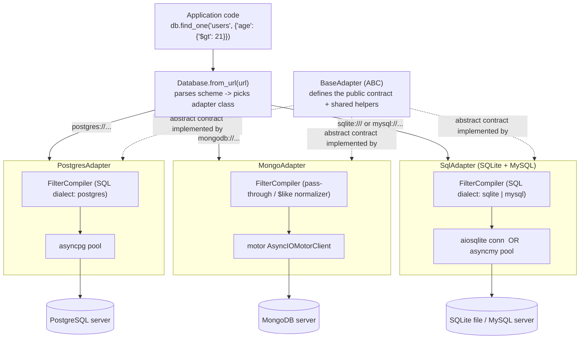

# `polydb` — Universal Async Database Abstraction Layer

**Planning Document v2 — Living Roadmap**
Status: **SQLite + Postgres + Mongo legs complete (28/28 features each)** · MySQL pending.
Last updated: 2026-09-05 · Branch: `development` (release via `master` → PyPI) · Package: `genius74o-polydb` on PyPI, `import polydb`
Progress: `src/polydb/adapters/sql/base.py` + `src/polydb/adapters/postgres.py` + `src/polydb/adapters/mongo.py` = live · `mysql_driver.py` = stub (`NotImplementedError`)

---

## 0. One-paragraph summary

`polydb` gives application code one async API for CRUD, schema, transactions, and raw-query
escape hatches, backed by exactly three adapters: **PostgreSQL** (`asyncpg`), **MongoDB**
(`motor`), and a **SQL-generic family** (`aiosqlite` for SQLite, `asyncmy` for MySQL) that
share one filter→WHERE-clause translator. Switching backends is a connection-string change.
The Mongo document model (nested dicts, dynamic schema) is the lowest common denominator for
the *query DSL*; the relational model (tables, columns, transactions) is the lowest common
denominator for *schema/structure* operations. Where the two models genuinely conflict
(e.g. joins, nested-document updates), the plan calls that out explicitly rather than
pretending it's solved — see §1 support matrix and §8 open questions.

---

## What to do next — TL;DR

> **Pick up here.** The rest of the document is reference. This section is the only one you need to decide what to work on.

### Where we are

- **Shipped (100% on 3 backends):** every feature §1.1–§1.8 (#1–#28) is implemented, tested, and passing on **SQLite** (`aiosqlite`, `SqlAdapter` dialect `sqlite`), **Postgres** (`asyncpg`, `PostgresAdapter`), and **MongoDB** (`motor`, `MongoAdapter`). The shared DSL compilers `compilers/sql_compiler.py` (SQL) and `compilers/mongo_compiler.py` (Mongo pass-through + `$like` normalizer) are both live.
- **Not started (stub raises `NotImplementedError` on `connect()`):** **MySQL** (`adapters/sql/mysql_driver.py`, `asyncmy`). `Database.from_url()` already resolves its scheme to the correct adapter class — the wiring is missing.

```
Done:   [████████████████████] SQLite  28/28  ✅
Done:   [████████████████████] Postgres 28/28  ✅
Done:   [████████████████████] Mongo    28/28  ✅
Todo:   [░░░░░░░░░░░░░░░░░░░░] MySQL    0/28  ⬜  ← NEXT
```

### What to do — in order (see §6 for rationale)

#### Step A — MongoDB adapter  →  `src/polydb/adapters/mongo.py`  (build order §6 step 4) ✅ **Done**

Shipped 2026-09-05: `motor` client, `maxPoolSize`/`serverSelectionTimeoutMS`, full DSL via `mongo_compiler.py`, native aggregation, `ClientSession` transactions (replica set → `TransactionsUnavailableError` on standalone), schemaless `create_collection`/`add_field` no-ops, deterministic index names, `raw` dict command / `explain` via `find().explain()`.

Checklist that landed:

1. ✅ `connect()` / `disconnect()` / `ping()` / `__aenter__/__aexit__` — `motor.AsyncIOMotorClient` via `url_parser.ConnectionConfig`; `tests/contract/test_connection.py` passes with `mongodb://` mocked.
2. ✅ `compilers/mongo_compiler.py` wired — `$like` → `$expr`/`$regexMatch`, `$not` → `$nor`.
3. ✅ Create: `insert_one` / `insert_many` / `upsert_one` (#7–#9) — `upsert_one` find-then-update-by-`_id`-or-insert (filter merges, doc wins).
4. ✅ Read: `find_one` / `find` / `count` / `exists` / `aggregate` (#10–#14) — `aggregate` native.
5. ✅ Update/Delete: `update_one` / `update_many` / `replace_one` / `delete_one` / `delete_many` (#15–#19) — `MongoCompiler.compile_update` validates `$push` native.
6. ✅ Schema: `create_collection` / `drop_collection` / `list_collections` / `create_index` / `add_field` (#20–#24) — schema ignored + `logger.info`, `add_field` warning.
7. ✅ Transactions: `transaction()` + `commit()`/`rollback()` (#25–#26) — `ClientSession` + `start_transaction` / `commit_transaction` / `abort_transaction` / `end_session`.
8. ✅ Escape hatch: `raw()` / `explain()` (#27–#28) — `raw` dict via `db.command`, `explain` via `find().explain()`.
9. ✅ Contract suite: `tests/contract/test_connection.py` updated; `docs/supported_operations_matrix.md` + `README.md` reflect Mongo live.

#### Step B — MySQL leg of the SQL family  →  `src/polydb/adapters/sql/mysql_driver.py` + `src/polydb/adapters/sql/dialects.py` (build order §6 step 5) ← **do this next**

MySQL is the lowest-risk step once Mongo is done: the compiler and dialect-switching are already proven by SQLite+Postgres.

**Checklist:**

1. Add `MysqlDialect` (placeholder `%s`, backtick quoting, `REGEXP` native) and `asyncmy` driver wiring in `mysql_driver.py` — mirror `sqlite_driver.py` structure, not `postgres.py`.
2. Adapt SQLite-specific `rowid`/`ctid` single-row targeting to a PK-based path (MySQL has no `rowid`).
3. Replace `PRAGMA table_info` introspection in `replace_one`/`_table_layout` with `information_schema` (same as Postgres leg already does).
4. Wire `pool_size` → `asyncmy` pool `max_size` (remove the SQLite "accepted but ignored" warning path for this dialect).
5. `upsert_one`: swap `ON CONFLICT` → `ON DUPLICATE KEY UPDATE` semantics inside the MySQL dialect branch.
6. Contract suite now runs 4-way: `postgres / mongo / sqlite / mysql` — no new tests, just new dialect wiring. Green is the gate.

#### Step C — Hardening & release

- Harden `tests/contract/` + `tests/unit/` to exercise all 4 backends; add `hypothesis` filter-compiler fuzz (§7.5) asserting SQLite≈Postgres≈MySQL row-set parity.
- Update `docs/supported_operations_matrix.md` + `README.md` (Current status table + Connecting table) + `examples/*.py`.
- Bump `version` in `pyproject.toml`, merge `development` → `master` to publish (see `README.md` Branching & releases).

### How to verify you're done (definition of done)

```bash
pip install -e ".[dev,all]"          # all four drivers (asyncpg, motor, aiosqlite, asyncmy)
PYTHONPATH=src pytest                 # unit + contract (needs PG/Mongo/MySQL — testcontainers or local)
PYTHONPATH=src pytest tests/unit/test_sql_compiler.py tests/unit/test_mongo_compiler.py -v
```

Contract gate: every `tests/contract/test_*.py` passes parametrized over `[postgres, mongo, sql_sqlite, sql_mysql]`. Support-matrix enforcement test (§7.4) ensures `docs/supported_operations_matrix.yaml` never drifts from `UnsupportedOperationError` behavior.

### If you only have 30 minutes

Do **Step B item 1** (MySQL `MysqlDialect` + `asyncmy` wiring): it unblocks every other MySQL item and proves `Database.from_url("mysql://…")` → `connect()` → `ping()` end-to-end. Next 30 min: item 2 (rowid→PK targeting), then item 3 (`information_schema` introspection).

---

## 1. Feature List

Support legend: ✅ Full · 🟡 Partial (works, with a caveat noted) · ❌ Not supported (raises
`UnsupportedOperationError`)

Build-status legend: ⬜ Not started · 🔨 In progress · ✅ Done — the **Status** column tracks **implementation progress** (has it been coded?), separate from the Postgres/Mongo/SQL-family columns which describe **design intent** (is it supposed to work on that backend?).

**Progress summary (2026-09-05):**

| Backend | Adapter file | Driver | Features #1–#28 | DSL compilers |
|---------|--------------|--------|-----------------|---------------|
| SQLite (SQL family) | `adapters/sql/base.py` (dialect `sqlite`) | `aiosqlite` | **28/28 ✅ Done** — `postgres://` dialect details not applicable | `sql_compiler.py` ✅ |
| Postgres | `adapters/postgres.py` | `asyncpg` (pool, `$1`, `"` quoting, `~` for `$regex`, `GROUP BY ()`, `ctid`) | **28/28 ✅ Done** | same `sql_compiler.py` ✅ |
| Mongo | `adapters/mongo.py` | `motor` | **28/28 ✅ Done** — `motor` client, `maxPoolSize`/`serverSelectionTimeoutMS`, native aggregation, `ClientSession` tx | `mongo_compiler.py` ✅ |
| MySQL (SQL family) | `adapters/sql/mysql_driver.py` | `asyncmy` | **0/28 ⬜ Todo** — stub, `connect()` raises `NotImplementedError` | `sql_compiler.py` (needs `MysqlDialect`) |

> **Reading the tables below:** every row shows `✅ Done` in *Status* because the **SQLite + Postgres + Mongo** legs are done. The per-backend columns show *design intent* (whether that feature will be ✅/🟡/❌ on that backend once implemented). For remaining work see "What to do next" at the top — **Step B = MySQL next**.

### 1.1 Connection management

| # | Signature | Description | Postgres | Mongo | SQL family | Status |
|---|---|---|---|---|---|---|
| 1 | `Database.from_url(url: str) -> Database` | Factory: parses a connection string, returns the correct adapter instance, unconnected. | ✅ | ✅ | ✅ | ✅ Done |
| 2 | `async def connect(self) -> None` | Opens the underlying pool/client. Idempotent — calling twice is a no-op. | ✅ | ✅ | ✅ | ✅ Done |
| 3 | `async def disconnect(self) -> None` | Closes pool/client, releases sockets. | ✅ | ✅ | ✅ | ✅ Done |
| 4 | `async def ping(self) -> bool` | Cheap round-trip health check. Returns `False` (logged, never raised) when the backend does not answer; `ConnectionNotOpenError` before `connect()`. | ✅ | ✅ | ✅ | ✅ Done |
| 5 | `async def __aenter__` / `__aexit__` | Context-manager sugar around connect/disconnect. | ✅ | ✅ | ✅ | ✅ Done |
| 6 | `self.pool_size`, `self.timeout` (config) | Pool tuning knobs, read from the URL query params and validated at parse time; exposed as properties on every adapter. | ✅ (wired — `max_size`/`command_timeout` on `asyncpg` pool) | ✅ (client wiring lands with build step 4) | 🟡 SQLite has no real pool (single-writer file), so a non-default `pool_size` is accepted but ignored with a logged warning. MySQL leg wires it in at build step 5. | ✅ Done |

### 1.2 Create

| # | Signature | Description | Postgres | Mongo | SQL family | Status |
|---|---|---|---|---|---|---|
| 7 | `async def insert_one(self, collection: str, doc: dict) -> InsertResult` | Insert a single record. | ✅ | ✅ | ✅ | ✅ Done (SQLite + Postgres; SQLite: `lastrowid`, Postgres: `RETURNING *` + PK pick) |
| 8 | `async def insert_many(self, collection: str, docs: list[dict]) -> InsertManyResult` | Bulk insert. | ✅ | ✅ | ✅ | ✅ Done (SQLite + Postgres; heterogeneous docs fill missing columns with `NULL`, one shared commit = all-or-nothing) |
| 9 | `async def upsert_one(self, collection: str, filter: dict, doc: dict) -> UpsertResult` | Insert-or-update by filter match. | ✅ (`ON CONFLICT`) | ✅ (`upsert=True`) | ✅ (`INSERT ... ON CONFLICT` / `ON DUPLICATE KEY`) | ✅ Done (SQLite + Postgres; implemented as Mongo-style find-then-update-first-match-or-insert so arbitrary filters work without unique-index knowledge — filter merges into the inserted row, doc wins on key conflicts) |

### 1.3 Read

| # | Signature | Description | Postgres | Mongo | SQL family | Status |
|---|---|---|---|---|---|---|
| 10 | `async def find_one(self, collection: str, filter: dict) -> dict \| None` | Fetch first matching record. | ✅ | ✅ | ✅ | ✅ Done (SQLite + Postgres; full §2.2 DSL filter support via `sql_compiler.py`) |
| 11 | `async def find(self, collection: str, filter: dict \| None = None, *, sort=None, limit=None, offset=None) -> list[dict]` | Fetch matching records. | ✅ | ✅ | ✅ | ✅ Done (SQLite + Postgres; `sort` is `(field, 1\|-1)` pairs, later pairs break ties; offset without limit compiles `LIMIT -1 OFFSET n` on SQLite, `OFFSET n` on Postgres) |
| 12 | `async def count(self, collection: str, filter: dict \| None = None) -> int` | Count matching records. | ✅ | ✅ | ✅ | ✅ Done (SQLite + Postgres) |
| 13 | `async def exists(self, collection: str, filter: dict) -> bool` | Existence check, short-circuits (LIMIT 1 / findOne projection). | ✅ | ✅ | ✅ | ✅ Done (SQLite + Postgres; `SELECT 1 … WHERE … LIMIT 1`) |
| 14 | `async def aggregate(self, collection: str, pipeline: list[dict]) -> list[dict]` | Grouping/aggregation. | 🟡 A **restricted** pipeline subset (`$match`, `$group`, `$sort`, `$limit`, `$count`) is translated to `GROUP BY`/`HAVING`. Anything beyond that raises `UnsupportedOperationError`. | ✅ Native. | 🟡 Same restricted subset as Postgres. | ✅ Done (SQLite + Postgres; subset implemented — repeatable `$match`, then at most one `$group`/`$sort`/`$limit`/`$count` in canonical order, accumulators `$sum`/`$avg`/`$min`/`$max`/`$count`; group output is Mongo-shaped incl. nested composite `_id`; a global `_id: null` group over zero input rows yields `[]`, not SQL's phantom NULL row. Known divergences from Mongo: NULL-handling inside `MIN`/`MAX`/`AVG` follows SQL semantics) |

### 1.4 Update

| # | Signature | Description | Postgres | Mongo | SQL family | Status |
|---|---|---|---|---|---|---|
| 15 | `async def update_one(self, collection: str, filter: dict, update: dict) -> UpdateResult` | Update first match. `update` uses `$set`/`$inc`/`$unset` operators (see §2). | ✅ | ✅ | ✅ | ✅ Done (SQLite + Postgres; full §2.2 filter DSL via the shared compiler + §2.4 update subset via `compile_update_set`; first match targeted by rowid (SQLite) / ctid (Postgres); empty SET clause reports honest `matched_count` with `modified_count=0`) |
| 16 | `async def update_many(self, collection: str, filter: dict, update: dict) -> UpdateResult` | Update all matches. | ✅ | ✅ | ✅ | ✅ Done (SQLite + Postgres; one parameterized `UPDATE … WHERE`. Known divergence from Mongo: both counts come from the statement's rowcount — rows whose values were already equal still count as modified) |
| 17 | `async def replace_one(self, collection: str, filter: dict, doc: dict) -> UpdateResult` | Full-document replace. | ✅ | ✅ | ✅ | ✅ Done (SQLite + Postgres; Mongo replace semantics on a relational row — every non-PK column rewritten, absent doc fields become `NULL`, primary-key columns preserved and rejected if present in `doc` via `PRAGMA table_info` introspection; never upserts) |

### 1.5 Delete

| # | Signature | Description | Postgres | Mongo | SQL family | Status |
|---|---|---|---|---|---|---|
| 18 | `async def delete_one(self, collection: str, filter: dict) -> DeleteResult` | Delete first match. | ✅ | ✅ | ✅ | ✅ Done (SQLite + Postgres; full §2.2 filter DSL via the shared compiler; first match targeted by rowid (SQLite) / ctid (Postgres); no match writes nothing) |
| 19 | `async def delete_many(self, collection: str, filter: dict) -> DeleteResult` | Delete all matches. | ✅ | ✅ | ✅ | ✅ Done (SQLite + Postgres; one parameterized `DELETE … WHERE`; empty filter clears the table like Mongo's `delete_many({})`; count from rowcount) |

### 1.6 Schema / structure

| # | Signature | Description | Postgres | Mongo | SQL family | Status |
|---|---|---|---|---|---|---|
| 20 | `async def create_collection(self, name: str, schema: Schema \| None = None) -> None` | Create a table/collection. `schema` is optional structured column spec (see illustrative `Schema` below). | ✅ Required (`schema=None` raises `SchemaRequiredError`). | ✅ `schema` ignored — Mongo is schemaless; a logged info-level note is emitted. | ✅ Required, same as Postgres. | ✅ Done (SQLite + Postgres; a small Schema→`CREATE TABLE` compiler — `schema=None` or a zero-field schema raises `SchemaRequiredError`; field names validated like any DSL identifier; str/int/float/bool map to native column types, datetime/json stored as TEXT holding ISO-8601 / serialized JSON; nullable/default/primary_key/unique all enforced by the DDL — an `INTEGER PRIMARY KEY` aliases rowid (SQLite) / `SERIAL PRIMARY KEY` (Postgres) so `inserted_id` works; creating an existing name raises `PolydbQueryError`) |
| 21 | `async def drop_collection(self, name: str) -> None` | Drop table/collection if exists. | ✅ | ✅ | ✅ | ✅ Done (SQLite + Postgres; `DROP TABLE IF EXISTS`, idempotent no-op on absent names) |
| 22 | `async def list_collections(self) -> list[str]` | Enumerate tables/collections. | ✅ | ✅ | ✅ | ✅ Done (SQLite + Postgres; sorted user tables from `sqlite_master`, excluding `sqlite_*` internals and views) |
| 23 | `async def create_index(self, collection: str, fields: list[str], *, unique: bool = False) -> None` | Create an index. | ✅ | ✅ | ✅ | ✅ Done (SQLite + Postgres; one `CREATE [UNIQUE] INDEX` with a deterministic derived name — `idx_<table>__<f1>__<f2>`, `uq_…` for unique — so re-issuing an identical call is an `IF NOT EXISTS` no-op matching Mongo's `createIndex`; caveat: a different spec colliding on the derived name is silently ignored; empty field list raises `InvalidFilterError`; indexing a missing column/table surfaces as `PolydbQueryError`) |
| 24 | `async def add_field(self, collection: str, field: str, type_: FieldType, default: Any = None) -> None` | Add a column (relational) / no-op with warning (Mongo, since docs are dynamic). | ✅ | 🟡 No-op + logged warning — new field just appears on next write. | ✅ | ✅ Done (SQLite + Postgres; `ALTER TABLE … ADD COLUMN`, same `_FIELD_TYPE_TO_SQL` mapping as #20; non-None scalar default becomes a DDL `DEFAULT` that also backfills existing rows; new columns always nullable — SQLite forbids PK/UNIQUE in ALTER TABLE so those constraints are out of contract; duplicate column / absent table → `PolydbQueryError`, bad name/type/non-scalar default → `InvalidFilterError`) |

### 1.7 Transactions

| # | Signature | Description | Postgres | Mongo | SQL family | Status |
|---|---|---|---|---|---|---|
| 25 | `async def transaction(self) -> AsyncContextManager[Transaction]` | Opens a transaction; all calls on the yielded `Transaction` object are atomic together. | ✅ Full ACID. | 🟡 Requires a replica set / Atlas (standalone Mongo has no multi-doc transactions) — raises `TransactionsUnavailableError` if the server topology doesn't support them. | ✅ Postgres/MySQL full ACID. 🟡 SQLite: single writer, transactions serialize rather than truly isolate under concurrency — documented, not hidden. | ✅ Done (SQLite + Postgres; `BEGIN`/`trx.start()` on context-manager entry, one atomic block — per-operation commits suppressed until the tx ends, so calls through the yielded handle *and* direct adapter calls inside the block commit/rollback together; a failed statement aborts the whole transaction (poisoned-transaction precedent) and later calls through the handle raise `TransactionInactiveError`; nested/concurrent transactions raise `UnsupportedOperationError`; transactional DDL rolls back on both) |
| 26 | `Transaction.commit()` / `Transaction.rollback()` | Explicit control; also auto-commit/rollback on context-manager exit. | ✅ | 🟡 (see #25) | ✅ | ✅ Done (SQLite + Postgres; explicit calls plus auto-commit on clean exit / auto-rollback when an exception escapes; a small state machine (`new → active → committed \| rolled_back \| aborted`) makes double-finalize and use-before-enter raise `TransactionInactiveError` instead of corrupting state) |

### 1.8 Escape hatch (raw queries)

| # | Signature | Description | Postgres | Mongo | SQL family | Status |
|---|---|---|---|---|---|---|
| 27 | `async def raw(self, query: Any, params: Any = None) -> Any` | Pass-through to the native driver. `query` is a SQL string for relational backends, a Mongo command dict for Mongo. Return type is intentionally `Any` — this method opts *out* of the abstraction. | ✅ (`str`, params tuple/dict) | ✅ (`dict` command) | ✅ (`str`, params tuple/dict) | ✅ Done (SQLite + Postgres; `query` must be a non-empty SQL string — no DSL compilation; `params` may be `None`, a positional sequence, or a named-parameter mapping (str/bytes rejected as near-certain quoting mistakes); rows return as `list[dict]`, empty for statements producing no rows; writes commit before returning exactly like every polydb write, and inside an open §1.7 transaction the statement joins the atomic block instead; a failing statement rolls back like any other operation and surfaces as `PolydbQueryError`, aborting an open transaction wholesale) |
| 28 | `async def explain(self, collection: str, filter: dict) -> dict` | Returns the backend's native query plan for a translated filter — debugging aid. | ✅ (`EXPLAIN`) | ✅ (`.explain()`) | ✅ (`EXPLAIN`) | ✅ Done (SQLite + Postgres; the filter compiles through the shared compiler exactly as `find()` would, then runs under `EXPLAIN QUERY PLAN` so the plan describes what the abstraction actually executes; returns `{"backend", "sql", "params", "plan"}` with the native plan rows (`id`/`parent`/`notused`/`detail`) as dicts; read-only, opens no write transaction) |

---

## 2. Filter / Query DSL Spec

The DSL surface is Mongo-shaped because Mongo's operator dict is already a clean,
serializable AST; the SQL family adapter's job is to compile this AST into parameterized
SQL. Mongo's adapter mostly passes it straight to the driver.

### 2.1 Grammar

```
filter        := {} | { field_expr (, field_expr)* }
field_expr    := field ":" (scalar | operator_expr | logical_expr)
operator_expr := { operator ":" scalar (, operator ":" scalar)* }
logical_expr  := "$and" | "$or" | "$nor" : [ filter (, filter)* ]
              |  "$not" : filter
scalar        := str | int | float | bool | null | list  (list only valid with $in/$nin)
```

Plain `{"status": "open"}` is shorthand for `{"status": {"$eq": "open"}}`.

> **Implementation note (empty filters):** `{}` sub-filters inside
> `$and`/`$or`/`$nor` compile to the literal `1 = 1` rather than being dropped,
> so Mongo's "{}-matches-everything" semantics survive negation — e.g.
> `{"$or": [{}, {"a": 1}]}` matches *everything* and `{"$nor": [{}, …]}` /
> `{"$not": {}}` match *nothing*. An empty operator dict (`{"age": {}}`) raises
> `InvalidFilterError`: the grammar requires at least one operator per operator
> expr, and silently matching all rows would hide caller bugs.

### 2.2 Operator table

| Operator | Meaning | Mongo | SQL translation |
|---|---|---|---|
| `$eq` | equals | native `{field: value}` | `field = %s` |
| `$ne` | not equals | native | `field <> %s` |
| `$gt` | greater than | native | `field > %s` |
| `$gte` | greater or equal | native | `field >= %s` |
| `$lt` | less than | native | `field < %s` |
| `$lte` | less or equal | native | `field <= %s` |
| `$in` | value in list | native | `field IN (%s, %s, ...)` |
| `$nin` | value not in list | native | `field NOT IN (%s, %s, ...)` |
| `$exists` | field is present / not null | native (`$exists: true/false`) | `field IS [NOT] NULL` |
| `$regex` | pattern match | native (`$regex`) | Postgres: `field ~ %s`. MySQL: `field REGEXP %s`. SQLite: compiled via a registered `REGEXP` user function (stdlib `re`), since SQLite has no native regex operator. |
| `$like` | SQL-style wildcard match (`%`, `_`) | Translated to a `$regex`-equivalent via a Mongo `$expr`+`$regexMatch`, since Mongo has no native `LIKE` | `field LIKE %s` |
| `$and` | logical AND of sub-filters | native | `(cond) AND (cond)` |
| `$or` | logical OR of sub-filters | native | `(cond) OR (cond)` |
| `$nor` | none of the sub-filters match | native | `NOT ((cond) OR (cond))` |
| `$not` | negation of a sub-filter | native | `NOT (cond)` |

> **Implementation note (Mongo leg):** every operator above is native Mongo
> except `$like`, so `mongo_compiler.py` passes them through unchanged after
> validating the §2 grammar — same rules and error wording as the SQL compiler,
> so both backends reject malformed filters with identical
> `InvalidFilterError`s before any driver sees them. Two Mongo-forced
> normalizations: **`$like`** becomes an anchored regex (`%` → `.*`, `_` → `.`,
> every other character escaped literally) run through `$expr` +
> `$regexMatch`, since Mongo has no native `LIKE` — the whole value must
> match, and the match is case-sensitive (Postgres parity; MySQL/SQLite
> default collations would fold case). Standalone **`$not`** is rewritten as a
> one-element `$nor`, because Mongo only allows `$not` as a field-level
> operator. Known divergence: a *negated* `$like` matches documents whose
> field is null/missing on Mongo (`$regexMatch` returns `false` there), while
> SQL's three-valued logic drops those rows from `NOT (… LIKE …)`. On §2.4,
> Mongo keeps all four update operators natively — including `$push`, which
> the SQL family hard-fails.

### 2.3 Worked example

```python
# Illustrative — not real implementation
filter = {
    "$and": [
        {"status": {"$in": ["open", "pending"]}},
        {"amount": {"$gte": 100, "$lt": 5000}},
        {"$or": [{"region": "UK"}, {"priority": {"$eq": "high"}}]},
    ]
}
```

**Mongo:** passed through unmodified (after `$like` normalization, unused here).

**SQL family compiled output** (Postgres dialect shown; MySQL/SQLite differ only in
placeholder style — `%s` vs `?` — and quoting):

```sql
-- Illustrative
WHERE (status IN ($1, $2) AND (amount >= $3 AND amount < $4) AND (region = $5 OR priority = $6))
-- params: ["open", "pending", 100, 5000, "UK", "high"]
```

The compiler always emits **parameterized** SQL — no string interpolation of values, ever.
Field names are validated against `^[A-Za-z_][A-Za-z0-9_]*$` and identifier-quoted
(`"field"` / `` `field` ``) before being placed in the query, which closes the SQL-injection
door on the *column-name* side (values are already safe via parameterization).

> **Implementation note (SQLite quoting):** the SQLite leg quotes identifiers with
> **backticks**, not double quotes. A double-quoted token that doesn't resolve to a column
> silently degrades to a string literal in SQLite (legacy DQS misfeature) — e.g.
> `WHERE "nope" REGEXP '.'` matches *every* row instead of raising. Backtick quoting always
> raises `no such column`, so a filter on a misspelled field surfaces as
> `PolydbQueryError` rather than silently wrong results.

### 2.4 Update-operator subset (used by `update_one`/`update_many`)

| Operator | Meaning | Mongo | SQL translation |
|---|---|---|---|
| `$set` | set field(s) to value | native | `SET field = %s` |
| `$unset` | remove field / set NULL | native | `SET field = NULL` |
| `$inc` | increment numeric field | native | `SET field = field + %s` |
| `$push` | append to array field | native | ❌ `UnsupportedOperationError` — no portable array-append in relational SQL without a JSON column convention (see §8) |

---

## 3. Code Style Guide

### 3.1 Naming conventions

- Classes: `PascalCase`, nouns — `PostgresAdapter`, `FilterCompiler`, `InsertResult`.
- Functions/methods: `snake_case`, verbs — `find_one`, `create_index`.
- Constants: `UPPER_SNAKE_CASE` — `DEFAULT_TIMEOUT_SECONDS`, `SUPPORTED_OPERATORS`.
- Private helpers: leading underscore — `_compile_filter`, `_quote_identifier`.
- Exceptions: `PascalCase` ending in `Error` — `UnsupportedOperationError`,
  `TransactionsUnavailableError`, `SchemaRequiredError`.
- Every backend module lives under a name matching its adapter:
  `polydb/adapters/postgres.py` → `class PostgresAdapter(BaseAdapter)`.

### 3.2 Docstring format (Google style, enforced)

```python
# Illustrative
async def find_one(self, collection: str, filter: dict[str, Any]) -> dict[str, Any] | None:
    """Fetch the first document matching ``filter``.

    Args:
        collection: Table or collection name.
        filter: Query DSL dict, see the Filter/Query DSL spec.

    Returns:
        The matching document, or ``None`` if no document matches.

    Raises:
        ConnectionNotOpenError: If ``connect()`` has not been called.
    """
```

### 3.3 Type-hint style

- Full type hints on every public method, `from __future__ import annotations` at the top
  of every module so forward refs and `|` unions work uniformly on 3.11.
- No `Any` for return types unless the method is explicitly an escape hatch (`raw`,
  `explain`).
- Prefer `TypedDict`/`dataclass` result objects (`InsertResult`, `UpdateResult`) over bare
  dicts, so IDEs and mypy catch misuse.

### 3.4 Error raising convention

All adapters raise from a single shared exception hierarchy in `polydb/exceptions.py`, never
the raw driver exception — the driver exception is chained via `raise ... from err` so it's
still inspectable, but application code only ever needs to catch `polydb` types.

```python
# Illustrative
class PolydbError(Exception):
    """Base class for all polydb exceptions."""

class ConnectionNotOpenError(PolydbError):
    """Raised when an operation is attempted before connect() succeeds."""

class UnsupportedOperationError(PolydbError):
    """Raised when a requested operation has no valid translation for this backend."""

class SchemaRequiredError(PolydbError):
    """Raised when create_collection() is called on a schema-requiring backend without a schema."""
```

Example of the chaining convention:

```python
# Illustrative
try:
    await self._pool.execute(sql, *params)
except asyncpg.PostgresError as err:
    raise PolydbQueryError(f"Postgres query failed: {sql}") from err
```

### 3.5 End-to-end method shape — same skeleton across all three adapters

Every adapter method follows this exact order: **(1) guard clause, (2) translate/compile,
(3) execute against native driver, (4) normalize result, (5) return polydb result type.**
This is the single most important consistency rule in the codebase — a reviewer should be
able to diff `postgres.py`'s `find_one` against `sql.py`'s `find_one` and see the same shape.

```python
# Illustrative — PostgresAdapter
async def find_one(self, collection: str, filter: dict[str, Any]) -> dict[str, Any] | None:
    """Fetch the first document matching filter. See BaseAdapter.find_one."""
    self._ensure_connected()                                    # 1. guard
    sql, params = self._compiler.compile_select(                # 2. translate
        collection, filter, limit=1
    )
    async with self._pool.acquire() as conn:                    # 3. execute
        row = await conn.fetchrow(sql, *params)
    return dict(row) if row is not None else None               # 4/5. normalize + return
```

```python
# Illustrative — MongoAdapter
async def find_one(self, collection: str, filter: dict[str, Any]) -> dict[str, Any] | None:
    """Fetch the first document matching filter. See BaseAdapter.find_one."""
    self._ensure_connected()                                    # 1. guard
    mongo_filter = self._compiler.compile_filter(filter)        # 2. translate (mostly pass-through)
    doc = await self._db[collection].find_one(mongo_filter)     # 3. execute
    return self._strip_object_id(doc) if doc is not None else None  # 4/5. normalize + return
```

```python
# Illustrative — SqlAdapter (SQLite/MySQL)
async def find_one(self, collection: str, filter: dict[str, Any]) -> dict[str, Any] | None:
    """Fetch the first document matching filter. See BaseAdapter.find_one."""
    self._ensure_connected()                                    # 1. guard
    sql, params = self._compiler.compile_select(                # 2. translate
        collection, filter, limit=1, placeholder=self.dialect.placeholder
    )
    row = await self._conn.fetchone(sql, params)                # 3. execute
    return dict(row) if row is not None else None               # 4/5. normalize + return
```

---

## 4. Architecture Diagram



Text-form call trace for one request:

```
app.find_one("orders", {"status": "open"})
  -> Database (thin façade holding self._adapter)
    -> adapter.find_one(...)                          # concrete class chosen at connect()-time
      -> self._compiler.compile_filter/compile_select  # DSL -> native shape
      -> native driver call (asyncpg / motor / aiosqlite / asyncmy)
        -> network/socket -> database engine
      <- raw native result (Record / dict / Row)
    <- normalized dict (or None) returned to app
```

---

## 5. Project File Structure

```
polydb/
├── pyproject.toml
├── README.md
├── LICENSE
├── CHANGELOG.md
├── src/
│   └── polydb/
│       ├── __init__.py                # public exports: Database, exceptions, result types
│       ├── database.py                 # Database façade + from_url() factory
│       ├── base.py                     # BaseAdapter ABC — the contract all adapters implement
│       ├── exceptions.py               # PolydbError hierarchy
│       ├── results.py                  # InsertResult, UpdateResult, DeleteResult, UpsertResult
│       ├── schema.py                   # Schema / FieldType dataclasses for create_collection()
│       ├── url_parser.py               # connection-string parsing -> ConnectionConfig
│       ├── dsl/
│       │   ├── __init__.py
│       │   ├── grammar.py              # filter/update AST dataclasses
│       │   └── validator.py            # operator whitelist, identifier validation
│       ├── adapters/
│       │   ├── __init__.py
│       │   ├── postgres.py             # PostgresAdapter (asyncpg)
│       │   ├── mongo.py                # MongoAdapter (motor)
│       │   └── sql/
│       │       ├── __init__.py
│       │       ├── base.py             # SqlAdapter shared logic
│       │       ├── dialects.py         # PostgresDialect n/a here; SqliteDialect, MysqlDialect
│       │       ├── sqlite_driver.py     # aiosqlite-specific wiring
│       │       └── mysql_driver.py      # asyncmy-specific wiring
│       └── compilers/
│           ├── __init__.py
│           ├── sql_compiler.py          # filter/update dict -> parameterized SQL
│           └── mongo_compiler.py        # filter/update dict -> Mongo query dict ($like normalizer etc.)
├── tests/
│   ├── conftest.py                     # spins up ephemeral Postgres/Mongo/MySQL via testcontainers
│   ├── contract/                       # ONE shared suite, parametrized over all 4 adapters
│   │   ├── test_connection.py
│   │   ├── test_create.py
│   │   ├── test_read.py
│   │   ├── test_update.py
│   │   ├── test_delete.py
│   │   ├── test_schema.py
│   │   ├── test_transactions.py
│   │   └── test_raw.py
│   ├── unit/
│   │   ├── test_url_parser.py
│   │   ├── test_sql_compiler.py
│   │   └── test_mongo_compiler.py
│   └── adapter_specific/
│       ├── test_postgres_only.py       # e.g. JSONB-specific features
│       ├── test_mongo_only.py          # e.g. native aggregation pipelines
│       └── test_sql_family_only.py     # e.g. SQLite REGEXP function registration
├── docs/
│   ├── connection.md                 # connection URLs, adapter resolution, tuning knobs
│   ├── dsl_spec.md
│   ├── supported_operations_matrix.md
│   └── migration_guide.md
└── examples/
    ├── basic_crud.py
    ├── switching_backends.py           # one script resolves 3–4 different connection strings
    └── transactions.py
```

---

## 6. Build Order

**Order: SQLite (inside the SQL family adapter) → PostgreSQL → MongoDB → SQL family's MySQL leg.**

| Step | What | Status | Notes |
|------|------|--------|-------|
| 1 | `BaseAdapter` ABC + `Database` façade + `url_parser.py` + exception hierarchy | ✅ Done | Contract locked before any adapter; no reshaping needed after step 2+. |
| 2 | SQL family adapter, **SQLite leg** (`aiosqlite`) | ✅ Done | Forced `sql_compiler.py` to exist early; hardest reusable piece; 28/28 features passing. |
| 3 | **PostgreSQL adapter** (reuse `sql_compiler.py`, Postgres dialect) | ✅ Done | Validated dialect-agnostic compiler: `~` for `$regex`, `$1` via `number_placeholders()`, `"` quoting, `GROUP BY ()`, `ctid`. Reference ACID impl alongside SQLite. |
| 4 | **MongoDB adapter** (`motor`, schemaless) | ✅ Done (2026-09-05) | See "What to do next" Step A (shipped). Odd-one-out (replica-set tx, `$push` native) so deliberately after the relational contract is proven. |
| 5 | **MySQL leg** of the SQL family (`asyncmy`, `%s` placeholders) | ⬜ **Next — do this now** | Lowest-risk step now Mongo is done: third dialect config + `information_schema` introspection + `ON DUPLICATE KEY UPDATE`. See Step B checklist. |
| 6 | Shared contract suite hardening + docs + examples | 🔨 Continuous | Runs alongside steps 2–5 (§7). Gate is 4-way parametrization: `postgres / mongo / sqlite / mysql`. |

<details><summary>Rationale for the order (why this sequence, not another)</summary>

1. **Step 1 — Contract first, zero backends.** Getting method signatures and result types locked means no adapter has to be reshaped later — reshaping after two adapters exist is expensive; reshaping before any exist is free.
2. **Step 2 — SQLite first.** Simplest relational target: no network/server/auth, trivial CI (temp file), forces the compiler to exist early since both MySQL and Postgres will reuse >80% of it. Proves the compiler correct before juggling Postgres's `$N` vs MySQL's `%s` — one variable at a time.
3. **Step 3 — Postgres second.** Validates the compiler is genuinely dialect-agnostic (only dialect-switched touches, no reshape) and gives the richest ACID reference for `transaction()` alongside SQLite.
4. **Step 4 — Mongo last among "real" backends.** *Odd one out* — schemaless, no JOIN, transactions require replica set. Building it after a mature contract suite lets `🟡`/`❌` marks stay honest instead of redesigning the contract around Mongo's constraints.
5. **Step 5 — MySQL last.** Cheapest increment: just dialect wiring, zero new tests, once steps 2–3 have proven the mechanism.
</details>

---

## 7. Testing Strategy

### 7.1 One contract suite, parametrized over adapters

```python
# Illustrative — tests/contract/test_read.py
import pytest

@pytest.fixture(params=["postgres", "mongo", "sql_sqlite", "sql_mysql"])
async def db(request, adapter_factory):
    """adapter_factory spins up (or reuses) a real ephemeral instance per backend."""
    database = await adapter_factory(request.param)
    yield database
    await database.disconnect()

async def test_find_one_returns_none_when_no_match(db):
    result = await db.find_one("users", {"email": "nobody@example.com"})
    assert result is None

async def test_find_applies_gt_operator(db):
    await db.insert_many("users", [{"age": 20}, {"age": 30}, {"age": 40}])
    results = await db.find("users", {"age": {"$gt": 25}})
    assert {r["age"] for r in results} == {30, 40}
```

Every test in `tests/contract/` runs 4 times (postgres, mongo, sqlite, mysql) from the
single fixture parametrization — that is the mechanism that *proves* identical behavior,
not documentation claiming it.

### 7.2 Real engines, not mocks

Use `testcontainers-python` to boot real Postgres and MySQL containers and a real Mongo
container in CI; SQLite needs no container (`:memory:` or temp file). Mocking the drivers
would let subtle dialect bugs (placeholder style, `NULL` semantics, autocommit behavior)
pass invisibly — the whole point of this library is faithful behavior parity, so the tests
must hit the real thing.

### 7.3 Layered test structure

- **`tests/unit/`** — pure functions, no I/O: URL parsing, filter compilation to SQL string
  (assert exact SQL + param tuple), Mongo filter normalization. Fast, run on every commit.
- **`tests/contract/`** — the shared behavioral suite from §7.1. This is the source of
  truth for "do all three backends behave the same."
- **`tests/adapter_specific/`** — anything explicitly *not* claimed to be portable
  (Postgres JSONB operators via `raw()`, Mongo native aggregation via `raw()`, SQLite
  `REGEXP` UDF registration). These tests exist precisely so nobody accidentally promotes
  a backend-specific trick into the contract suite by mistake.

### 7.4 Support-matrix enforcement

A small meta-test iterates the feature table in §1 (kept as a machine-readable
`docs/supported_operations_matrix.yaml` mirrored from the Markdown table) and asserts:
for every `❌` cell, calling that method on that adapter actually raises
`UnsupportedOperationError` — so the matrix in the docs can never silently drift out of
sync with real behavior.

### 7.5 Property-based fuzzing of the filter compiler

Use `hypothesis` to generate random valid filter DSL trees (bounded depth) and assert two
invariants for every generated filter: (1) the SQL compiler never raises on well-formed
input, and (2) running the same filter against SQLite and Postgres in the contract suite
returns the same row set for a fixed seeded dataset.

---

## 8. Open Questions

1. ~~**Package name**~~ — **Resolved: Python import `polydb`, PyPI distribution `genius74o-polydb`** (`polydb` is squatted). See `pyproject.toml` + `README.md`. ✅
2. **Sync support** — async-first is specified; is a sync wrapper (e.g. via
   `asyncio.run` shims, à la `httpx`'s sync client) in scope for v1, or strictly async-only? *(deferred — v1 is async-only, revisit after MySQL leg)*
3. **Transaction scope** — is cross-collection/cross-table transaction support required, or
   is single-collection-at-a-time transactional safety sufficient for v1? This affects
   whether `Transaction` needs to hold multiple cursors/sessions simultaneously.
4. **Schema strictness on the SQL family** — should `create_collection(schema=...)` support
   only a small common type set (`str`, `int`, `float`, `bool`, `datetime`, `json`), or do
   you want raw dialect-specific column types (`VARCHAR(255)` vs `TEXT`) escape-hatched
   through too?
5. **`$push` / array-field updates on SQL backends** — acceptable to hard-fail
   (`UnsupportedOperationError`) as scoped in §2.4, or do you want a JSON-column convention
   (store the field as a JSON/JSONB column, unpack-modify-repack) to make it work at the
   cost of atomicity guarantees?
6. **Aggregation pipeline scope** — is the restricted `$match/$group/$sort/$limit/$count`
   subset (§1.3, #14) enough, or does v1 need to support joins/`$lookup`-style operations
   translated to SQL `JOIN`s? (This is a substantial scope increase if yes.)
7. **MongoDB transaction requirement** — should `polydb` require users to run Mongo as a
   replica set (even a single-node one, which Mongo supports) so transactions always work,
   or should the library silently degrade to non-transactional writes on standalone Mongo?
8. **Migration/versioning story** — is schema migration (e.g. `alembic`-style versioned
   migrations) in scope for this library, or strictly out of scope (left to the app)?
9. **Connection string format for the SQL family** — should `mysql://` and `sqlite://`
   resolve to the *same* adapter class internally (as specified) with only the dialect
   differing, confirming this matches your intent of "one adapter, one family"?
10. **Minimum supported server versions** — e.g. Postgres 13+? MongoDB 6+ (for stable
    transaction support)? MySQL 8+? This affects which SQL features (e.g. `RETURNING`,
    window functions) are safe to rely on internally.
11. **Observability** — do you want structured logging / OpenTelemetry spans around each
    adapter call baked into v1, or added later as a separate concern?
12. ~~**License**~~ — **Resolved: MIT** (`LICENSE` file, `pyproject.toml` `license`). ✅

---

*End of planning document v2 — see "What to do next" at the top for the current action list. SQLite + Postgres + Mongo legs shipped (28/28 each); MySQL is the next build step.*